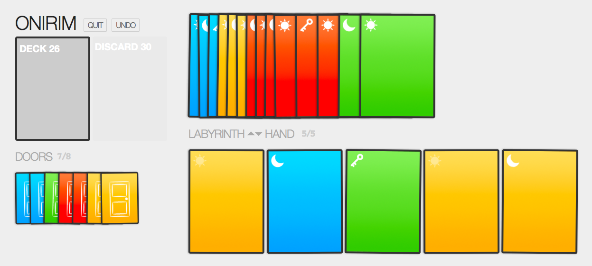

# ONIRIM

`onirim` is a solitaire card game based on [Onirim][Onirim] from
Z-Man Games. In Onirim you're trying to escape from sort of insane
dreamworld by finding doors.

<strong>You can play it [here](https://ryanfunduk.com/onirim).</strong>
<small>But you might want to take a look at the rules first :)</small>

[Onirim]: https://www.zmangames.com/en/products/onirim/

## Rules

First, go buy Onirim from your local games store/Amazon/whatever :)
I'm not going to cover the rules here. If it's not possible
to get a copy of the real game, visit Z-Man Games to get
a copy of the [rules in PDF][PDF].

[PDF]: https://images.zmangames.com/filer_public/fd/0e/fd0ef6a2-c019-47a2-910a-a556f03a3d02/zm4900_onirim_rules.pdf

## Usage

This is a pure JavaScript project using [React][React], [Redux][Redux],
[ReactDnD][ReactDnD], [Webpack][Webpack], and some other bits and pieces.

[React]: http://facebook.github.io/react/
[Redux]: https://github.com/rackt/redux
[ReactDnD]: http://gaearon.github.io/react-dnd/
[Webpack]: http://webpack.github.io/

### Locally/Development

I'm using Node v4.1.0 and npm 3.3.2. It is likely to
work with Node v0.12+ and npm 2, though.

    git clone git@github.com:rfunduk/onirim.git && cd onirim
    npm install
    npm run start

Then visit [localhost:5300](http://localhost:5300) in your browser.
In development you'll get the same game every time by default.

### Tests

There are 100 tests!

    npm run test

Also, code coverage!

    npm run coverage
    open coverage/lcov-report/index.html

### Production

    npm run build
